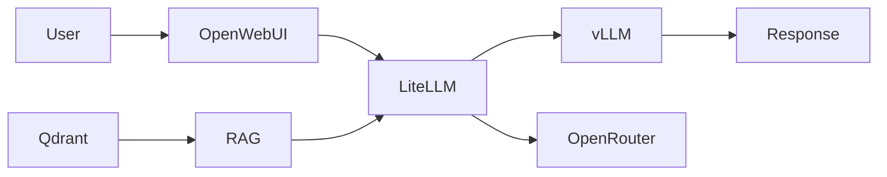

# 📚 AI-SWARM-MIAMI-2025 Documentation Index

**Version**: 1.0.0
**Last Updated**: September 23, 2025
**Project Location**: `/home/starlord/OrcaQueen`

## 🎯 Executive Summary

This documentation index serves as the master reference for the AI-SWARM-MIAMI-2025 distributed AI inference system. The project implements a 3-node swarm architecture featuring uncensored AI models, autonomous research capabilities, and an 80% cost optimization strategy.

---

## 📊 Documentation Structure

### 1. PROJECT DOCUMENTATION MAP

#### 1.1 Core Documentation

| Document | Location | Purpose | Status |
|----------|----------|---------|--------|
| **Main README** | `/README.md` | Project overview, quick start guide | ✅ Complete |
| **Architecture Design** | `/docs/ARCHITECTURE.md` | Complete system architecture and design decisions | ✅ Complete |
| **License** | `/LICENSE.md` | MIT license terms | ✅ Complete |
| **Documentation Index** | `/DOCUMENTATION_INDEX.md` | Master documentation reference (this file) | ✅ Complete |

#### 1.2 Deployment Documentation

| Document | Location | Purpose | Status |
|----------|----------|---------|--------|
| **Deployment Plan** | `/DEPLOYMENT_PLAN_FINAL.md` | Final deployment strategy with Railway Pro | ✅ Complete |
| **Deployment Checklist** | `/DEPLOYMENT_CHECKLIST.md` | ARM64 deployment validation checklist | ✅ Complete |
| **DevOps Review** | `/DEVOPS_REVIEW_FINAL.md` | DevOps implementation analysis | ✅ Complete |
| **Deploy Script** | `/deploy.sh` | Main deployment automation script | ✅ Complete |

#### 1.3 Analysis Reports

| Document | Location | Purpose | Status |
|----------|----------|---------|--------|
| **Code Analysis** | `/claudedocs/COMPREHENSIVE_CODE_ANALYSIS_REPORT.md` | Comprehensive codebase analysis | ✅ Complete |

#### 1.4 Session Memory

| Document | Location | Purpose | Status |
|----------|----------|---------|--------|
| **Project Architecture** | `/.serena/memories/project_architecture.md` | Architecture summary for session persistence | ✅ Complete |
| **Deployment Strategy** | `/.serena/memories/deployment_strategy.md` | Deployment approach memory | ✅ Complete |
| **Deployment Status** | `/.serena/memories/deployment_status.md` | Current deployment state | ✅ Complete |

---

### 2. API DOCUMENTATION

#### 2.1 Service APIs

| Service | Port | Documentation | Authentication |
|---------|------|---------------|----------------|
| **Open WebUI** | 3000 | REST API for UI control | JWT tokens |
| **LiteLLM Gateway** | 4000 | OpenAI-compatible API | Bearer token |
| **vLLM Primary** | 8000 | Inference API | API key |
| **vLLM Secondary** | 8001 | Backup inference API | API key |
| **Qdrant Vector DB** | 6333 | Vector search API | API key |
| **SillyTavern** | 8080 | Chat interface API | Session-based |
| **GPT Researcher** | 8001 | Research automation API | API key |

#### 2.2 Data Models

```yaml
Core_Models:
  ChatRequest:
    - model: string
    - messages: array
    - temperature: float
    - max_tokens: integer

  VectorSearch:
    - collection: string
    - query: array[float]
    - limit: integer
    - filter: object

  ResearchTask:
    - query: string
    - max_iterations: integer
    - search_depth: string
```

#### 2.3 Integration Patterns

- **Model Routing**: LiteLLM → vLLM/OpenRouter
- **Vector Storage**: Documents → Embeddings → Qdrant
- **Research Pipeline**: Query → Search → Analysis → Report
- **Cost Optimization**: Simple → Free Tier | Complex → Premium

---

### 3. DEPLOYMENT DOCUMENTATION

#### 3.1 Infrastructure Setup

##### Docker Compose Files

| File | Purpose | Node |
|------|---------|------|
| `/deploy/01-oracle-ARM.yml` | Oracle ARM node services | Oracle |
| `/deploy/02-starlord-OPTIMIZED.yml` | Starlord GPU node services | Starlord |
| `/deploy/03-thanos-SECURED.yml` | Thanos worker node services | Thanos |
| `/deploy/04-railway-services.yml` | Railway Pro auxiliary services | Cloud |
| `/docker-compose.railway.yml` | Railway-specific configuration | Cloud |

##### Deployment Scripts

| Script | Location | Purpose |
|--------|----------|---------|
| **Infrastructure Validation** | `/deploy/00-infrastructure-validation.sh` | Pre-deployment checks |
| **Secrets Management** | `/deploy/secrets-management.sh` | API key and secret handling |
| **Main Deployment** | `/deploy.sh` | Orchestrated deployment script |

#### 3.2 Configuration Management

##### Configuration Files

| Config | Location | Purpose |
|--------|----------|---------|
| **LiteLLM Config** | `/config/litellm.yaml` | Model routing and pricing |
| **Security Config** | `/config/security.yml` | Security policies and rules |
| **API Key Security** | `/config/api-key-security.yml` | API key management |
| **Prometheus** | `/config/prometheus.yml` | Metrics collection |
| **Alert Rules** | `/config/alert.rules.yml` | Monitoring alerts |
| **SearXNG** | `/config/searxng-settings.yml` | Search engine configuration |

##### Environment Files

| File | Purpose | Security |
|------|---------|----------|
| `.env.example` | Template for environment variables | ✅ Safe to commit |
| `.env.production` | Production secrets | 🔴 NEVER commit |

#### 3.3 Operational Procedures

##### Startup Sequence

```bash
1. Oracle Node Services (PostgreSQL, Redis, Consul)
2. LiteLLM Gateway and Open WebUI
3. Starlord vLLM Inference
4. Thanos SillyTavern and GPT Researcher
5. Monitoring Stack (Prometheus, Grafana)
```

##### Shutdown Sequence

```bash
1. User-facing services (SillyTavern, Open WebUI)
2. Inference engines (vLLM)
3. Data services (Qdrant, PostgreSQL)
4. Infrastructure services (Redis, Consul)
```

---

### 4. ARCHITECTURE DOCUMENTATION

#### 4.1 System Design

##### Node Architecture

```text
Oracle ARM (100.96.197.84) - 22GB RAM
├── Orchestration Layer
│   ├── LiteLLM Gateway
│   ├── Open WebUI
│   └── HAProxy Load Balancer
├── Data Layer
│   ├── PostgreSQL
│   └── Redis Cache
└── Monitoring Layer
    ├── Prometheus
    └── Grafana

Starlord (100.72.73.3) - RTX 4090, 64GB RAM
├── Inference Layer
│   ├── vLLM Primary (Mixtral-8x7B)
│   └── vLLM Secondary (Mistral-7B)
├── Vector Layer
│   └── Qdrant (EXISTING)
└── Storage Layer
    └── Model Cache (PCIe 5 NVMe)

Thanos (100.122.12.54) - RTX 3080, 61GB RAM
├── Interface Layer
│   ├── SillyTavern
│   └── ST Extras
├── Research Layer
│   ├── GPT Researcher
│   └── Document Processor
└── RAG Layer
    └── RAG Pipeline
```

##### Data Flow Diagrams



#### 4.2 Component Interactions

##### Service Dependencies

```yaml
Service_Dependencies:
  LiteLLM:
    requires: [PostgreSQL, Redis]
    connects_to: [vLLM, OpenRouter]

  Open_WebUI:
    requires: [LiteLLM]
    connects_to: [PostgreSQL]

  vLLM:
    requires: [CUDA, Model_Files]
    connects_to: [Qdrant]

  GPT_Researcher:
    requires: [LiteLLM]
    connects_to: [SearXNG, Tavily]
```

---

### 5. DEVELOPMENT DOCUMENTATION

#### 5.1 Setup Guides

##### Local Development Setup

```bash
# Clone repository
git clone https://github.com/aahmed954/OrcaQueen.git
cd OrcaQueen

# Configure environment
cp .env.example .env
# Edit .env with your configurations

# Install dependencies
pip install -r requirements.txt

# Run tests
pytest tests/
```

##### Docker Development

```bash
# Build images
docker-compose build

# Run in development mode
docker-compose -f docker-compose.dev.yml up

# Access services
# Open WebUI: http://localhost:3000
# LiteLLM: http://localhost:4000
```

#### 5.2 Contribution Guidelines

##### Code Standards

- **Python**: PEP 8 compliance, type hints required
- **Docker**: Multi-stage builds, non-root users
- **YAML**: 2-space indentation, comments for complex sections
- **Bash**: ShellCheck compliance, error handling

##### Pull Request Process

1. Fork repository
2. Create feature branch (`feature/your-feature`)
3. Write tests for new functionality
4. Ensure all tests pass
5. Update documentation
6. Submit PR with description

#### 5.3 Coding Standards

##### Python Code Style

```python
# Required imports structure
from typing import Dict, List, Optional
import logging

# Class naming: PascalCase
class ModelRouter:
    """Docstring required for all classes."""

    def route_request(self, request: Dict) -> Dict:
        """Method docstrings with type hints."""
        pass
```

##### Docker Best Practices

```dockerfile
# Multi-stage builds
FROM python:3.11-slim as builder
# Build stage

FROM python:3.11-slim
# Runtime stage
USER nonroot
```

---

### 6. OPERATIONAL DOCUMENTATION

#### 6.1 Monitoring

##### Metrics Collection

| Metric | Source | Collection Interval | Retention |
|--------|--------|-------------------|-----------|
| GPU Utilization | nvidia-smi exporter | 15s | 30d |
| API Latency | LiteLLM metrics | 10s | 7d |
| Model Usage | Custom metrics | 30s | 90d |
| Cost Tracking | OpenRouter API | 5m | 1y |

##### Dashboards

- **System Overview**: CPU, Memory, Network, Disk
- **GPU Performance**: Utilization, Memory, Temperature
- **API Metrics**: Request rate, latency, errors
- **Cost Analysis**: Model usage, daily spend, projections

#### 6.2 Logging

##### Log Locations

```yaml
Service_Logs:
  Oracle:
    LiteLLM: /var/log/litellm/
    OpenWebUI: /var/log/openwebui/
    PostgreSQL: /var/log/postgresql/

  Starlord:
    vLLM: /var/log/vllm/
    Qdrant: /var/log/qdrant/

  Thanos:
    SillyTavern: /var/log/sillytavern/
    GPT_Researcher: /var/log/gpt-researcher/
```

##### Log Aggregation

- **ELK Stack**: Elasticsearch, Logstash, Kibana
- **Log Levels**: ERROR, WARN, INFO, DEBUG
- **Retention**: 30 days hot, 90 days cold storage

#### 6.3 Troubleshooting

##### Common Issues and Solutions

###### vLLM Not Starting

```bash
# Check GPU memory
nvidia-smi
# Solution: Reduce batch size in config

# Check CUDA
nvcc --version
# Solution: Ensure CUDA 12.1+ installed
```

###### Network Connectivity

```bash
# Check Tailscale
tailscale status
# Solution: tailscale up --authkey=KEY

# Test connectivity
ping 100.96.197.84
# Solution: Check firewall rules
```

###### High Latency

```bash
# Check model loading
docker logs starlord-vllm | grep "Model loaded"
# Solution: Ensure models cached locally

# Check batch processing
curl localhost:8000/metrics | grep batch
# Solution: Adjust batch size
```

#### 6.4 Maintenance Procedures

##### Backup Procedures

```bash
# Database backup
pg_dump -h localhost -U litellm -d litellm > backup.sql

# Qdrant backup
curl -X POST http://localhost:6333/collections/backup

# Configuration backup
tar -czf config-backup.tar.gz config/ .env
```

##### Update Procedures

```bash
# Pull latest changes
git pull origin main

# Update Docker images
docker-compose pull

# Rolling update
docker-compose up -d --no-deps --build service_name
```

##### Key Rotation

```python
# Automated key rotation script
python scripts/key_rotation.py --rotate-all
```

---

## 📋 Documentation Quality Assessment

### ✅ Complete Documentation

- Project overview and quick start
- Architecture design and rationale
- Deployment plans and checklists
- Security configuration
- Monitoring setup

### ⚠️ Partial Documentation

- API endpoint specifications (basic coverage)
- Integration testing procedures (limited)
- Performance tuning guides (basic)
- Disaster recovery procedures (outline only)

### ❌ Missing Documentation

- Detailed API request/response schemas
- Comprehensive integration test suite documentation
- Advanced performance optimization guide
- Detailed disaster recovery runbooks
- User training materials
- Video tutorials and walkthroughs

---

## 🔍 Knowledge Gaps Analysis

### Critical Gaps

1. **API Documentation**: Need OpenAPI/Swagger specs for all services
2. **Integration Testing**: Comprehensive test suite documentation needed
3. **Security Runbook**: Incident response procedures missing
4. **Performance Baseline**: Detailed benchmarking documentation needed

### Improvement Opportunities

1. **Interactive Documentation**: Consider adding Docusaurus or MkDocs
2. **API Explorer**: Implement Swagger UI for API testing
3. **Architecture Diagrams**: Add more detailed Mermaid/PlantUML diagrams
4. **Video Content**: Create deployment and troubleshooting videos

---

## 🔎 Searchable Documentation Structure

### Quick Reference Tags

- `#architecture` - System design and architecture
- `#deployment` - Deployment procedures
- `#api` - API documentation
- `#security` - Security configurations
- `#monitoring` - Monitoring and observability
- `#troubleshooting` - Problem resolution
- `#performance` - Performance optimization
- `#development` - Development guides

### Search Patterns

```bash
# Find all deployment-related docs
grep -r "deploy" docs/ --include="*.md"

# Find API documentation
find . -name "*api*.md" -o -name "*API*.md"

# Find configuration examples
grep -r "example" config/ --include="*.yml"
```

---

## 📚 Additional Resources

### Internal Resources

- **GitHub Repository**: <https://github.com/aahmed954/OrcaQueen>
- **CI/CD Pipeline**: `.github/workflows/ci.yml`
- **Issue Tracker**: GitHub Issues

### External Documentation

- **vLLM**: <https://docs.vllm.ai>
- **LiteLLM**: <https://docs.litellm.ai>
- **Qdrant**: <https://qdrant.tech/documentation>
- **SillyTavern**: <https://docs.sillytavern.app>
- **Open WebUI**: <https://docs.openwebui.com>

---

## 🔄 Documentation Maintenance

### Update Schedule

- **Weekly**: Deployment status, operational metrics
- **Monthly**: Architecture updates, performance baselines
- **Quarterly**: Complete documentation review
- **As Needed**: API changes, security updates

### Documentation Standards

1. All documentation in Markdown format
2. Version control through Git
3. Peer review for major changes
4. Automated link checking
5. Regular accuracy audits

---

## 📝 Notes

This documentation index is a living document and should be updated as the project evolves. For questions or contributions, please open an issue in the GitHub repository.

**Last Review Date**: September 23, 2025
**Next Review Date**: October 23, 2025
**Maintainer**: DevOps Team

---

### Generated with comprehensive analysis of the AI-SWARM-MIAMI-2025 project structure
