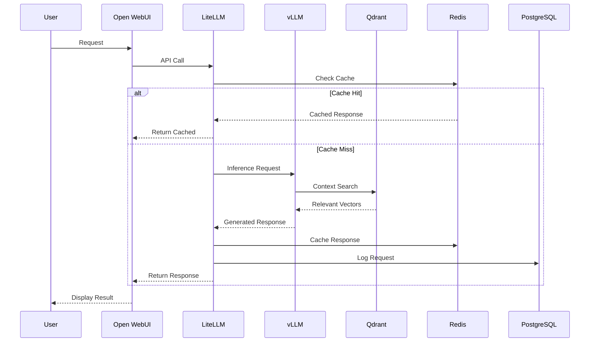

# 🕸️ AI-SWARM-MIAMI-2025 Knowledge Graph & Integration Diagrams

> **Visual representation of system architecture and relationships**

---

## 🌐 System Architecture Overview

```text
┌──────────────────────────────────────────────────────────────────────────────┐
│                          AI-SWARM-MIAMI-2025                          │
│                     3-Node Distributed AI Architecture                │
└───────────────────────────┬────────────────────┬────────────────────────┘
                            │                   │
                            ▼                   ▼
    ┌───────────────────────┐   ┌───────────────────────────────┐
    │    🌍 USER LAYER      │   │       📊 MONITORING LAYER       │
    │                       │   │                                 │
    │  • Web Interface      │   │  • Prometheus   • AlertManager  │
    │  • API Access         │   │  • Grafana      • Langfuse      │
    │  • Chat UIs           │   │  • ELK Stack    • Health Checks │
    └──────────┬────────────┘   └──────────────┬────────────────┘
                 │                            │
                 ▼                            ▼
    ┌────────────────────────────────────────────────────────────────────┐
    │                      🏯 ORCHESTRATION LAYER                        │
    │                                                                  │
    │    ┌────────────────────────────────────────────────────────┐    │
    │    │                 ORACLE NODE (100.96.197.84)                │    │
    │    │                      ARM A1 - 22GB RAM                     │    │
    │    │                                                            │    │
    │    │  ┌───────────────┐  ┌─────────────┐  ┌────────────┐  │    │
    │    │  │  Open WebUI  │  │  LiteLLM   │  │  HAProxy  │  │    │
    │    │  │    :3000     │  │   :4000    │  │   :8080   │  │    │
    │    │  └───────────────┘  └─────────────┘  └────────────┘  │    │
    │    │                                                            │    │
    │    │  ┌───────────────┐  ┌─────────────┐  ┌────────────┐  │    │
    │    │  │  PostgreSQL  │  │   Redis    │  │   Vault   │  │    │
    │    │  │    :5432     │  │   :6379    │  │   :8200   │  │    │
    │    │  └───────────────┘  └─────────────┘  └────────────┘  │    │
    │    └──────────────────────────┬────────────────────────────┘    │
    │                                  │                                    │
    └──────────────────────────────────┼──────────────────────────────────┘
                                       │
                   ┌───────────────────┼───────────────────┐
                   │                   │                   │
                   ▼                   ▼                   ▼
    ┌────────────────────────────────────────────────────────────────────┐
    │                        ⚔️ COMPUTE LAYER                             │
    │                                                                  │
    │  ┌────────────────────────────┐    ┌────────────────────────────┐  │
    │  │ STARLORD (100.72.73.3)    │    │  THANOS (100.122.12.54)   │  │
    │  │ Ryzen 9 7950X3D + RTX 4090│    │  Ryzen 9 5900X + RTX 3080 │  │
    │  │                            │    │                            │  │
    │  │ ┌─────────┐ ┌──────────┐ │    │ ┌─────────────┐ ┌────────┐ │  │
    │  │ │  vLLM   │ │  Qdrant  │ │    │ │ SillyTavern │ │  GPT   │ │  │
    │  │ │  :8000  │ │  :6333   │ │    │ │    :8080    │ │Research│ │  │
    │  │ └─────────┘ └──────────┘ │    │ └─────────────┘ └────────┘ │  │
    │  │                            │    │                            │  │
    │  │ ┌──────────────────────┐ │    │ ┌──────────────────────┐ │  │
    │  │ │    Model Cache      │ │    │ │    RAG Pipeline      │ │  │
    │  │ │  24GB VRAM Models   │ │    │ │  60TB Google Drive   │ │  │
    │  │ └──────────────────────┘ │    │ └──────────────────────┘ │  │
    │  └────────────────────────────┘    └────────────────────────────┘  │
    │                                                                  │
    └────────────────────────────────────────────────────────────────────┘
```

---

## 🔄 Service Communication Flow



---

## 🎐 Network Topology

```text
                        🌍 INTERNET
                             │
                    ┌────────┴────────┐
                    │   Tailscale    │
                    │  Mesh Network   │
                    └─────┬─────────┘
                          │
        ┌──────────────────┼──────────────────┐
        │                  │                  │
        ▼                  ▼                  ▼
┌─────────────┐   ┌─────────────┐   ┌─────────────┐
│   ORACLE    │◀──▶│  STARLORD   │◀──▶│   THANOS    │
│100.96.197.84│   │100.72.73.3  │   │100.122.12.54│
└─────────────┘   └─────────────┘   └─────────────┘

Network Rules:
- All nodes on Tailscale private mesh
- mTLS between services
- Firewall default: DENY
- Allowed: Specific service ports only
```

---

## 📦 Container Dependency Graph

```yaml
Dependency Tree:
├── Infrastructure Layer
│   ├── consul (Service Discovery)
│   ├── vault (Secrets) → depends_on: [consul]
│   └── haproxy (Load Balancer) → depends_on: [consul]
│
├── Data Layer
│   ├── postgres (Primary Database)
│   ├── redis (Cache & Queue)
│   └── qdrant (Vector Database)
│
├── Application Layer
│   ├── litellm → depends_on: [postgres, redis, vault]
│   ├── open-webui → depends_on: [litellm, redis]
│   ├── vllm → depends_on: [nvidia-driver]
│   ├── sillytavern → depends_on: [litellm]
│   └── gpt-researcher → depends_on: [qdrant]
│
└── Monitoring Layer
    ├── prometheus → depends_on: [all_services]
    ├── grafana → depends_on: [prometheus]
    ├── alertmanager → depends_on: [prometheus]
    └── node-exporter (on each node)
```

---

## 🔌 Integration Points Matrix

| Source | Target | Protocol | Port | Purpose | Authentication |
|--------|--------|----------|------|---------|----------------|
| User | Open WebUI | HTTPS | 3000 | Web Interface | JWT |
| Open WebUI | LiteLLM | HTTP | 4000 | Model Gateway | API Key |
| LiteLLM | vLLM | HTTP | 8000 | Local Inference | None (Internal) |
| LiteLLM | Redis | Redis | 6379 | Caching | Password |
| LiteLLM | PostgreSQL | PostgreSQL | 5432 | Persistence | SSL + Password |
| SillyTavern | LiteLLM | HTTP | 4000 | Chat API | API Key |
| GPT Researcher | Qdrant | HTTP/gRPC | 6333 | Vector Search | API Key |
| GPT Researcher | SearXNG | HTTP | 8080 | Web Search | None |
| RAG Pipeline | Qdrant | HTTP/gRPC | 6333 | Vector Store | API Key |
| Prometheus | All Services | HTTP | /metrics | Monitoring | None |
| Grafana | Prometheus | HTTP | 9090 | Metrics Query | API Key |
| Vault | All Services | HTTP | 8200 | Secrets | Token |
| HAProxy | Backend Services | HTTP/TCP | Various | Load Balancing | mTLS |

---

## 🎯 Model Routing Decision Tree

```mermaid
flowchart TD
  A[Request Arrives at LiteLLM]
  A --> B{Model Type?}
  B --> C1[Local Model (llama-3.2-dark)]
  B --> C2[API Model]
  
  C1 --> D1{vLLM Available?}
  D1 --> E1[YES: Route to vLLM:8000]
  D1 --> E2[NO: Queue or Fallback]
  
  C2 --> F1{Gemini Models?}
  C2 --> F2{OpenRouter Models?}
  
  F1 --> G1{Budget OK?}
  G1 --> H1[YES: Use Primary Key]
  G1 --> H2[NO: Use Secondary/Free]
  F1 --> I1{Context > 128K?}
  I1 --> J1[YES: gemini-2.5-pro (2M context)]
  I1 --> J2[NO: gemini-2.5-flash (1M context)]
  
  F2 --> K1{Credits Available?}
  K1 --> L1[YES: Route to OpenRouter]
  K1 --> L2[NO: Free Tier Fallback]
  F2 --> M1[Free Tier Models]
  M1 --> M2[deepseek-v3.1]
  M1 --> M3[grok-4-fast-free]
  M1 --> M4[gemini-2.5-flash-free]
  
  A --> N[Apply Rate Limiting]
  N --> O1[Check requests/minute]
  N --> O2[Check tokens/hour]
  N --> P[Return Response or Error]
```

Request Arrives at LiteLLM
│
├── Check Model Request
│   │
│   ├── Local Model (llama-3.2-dark)?
│   │   │
│   │   ├── YES → Check vLLM Availability
│   │   │   │
│   │   │   ├── Available → Route to vLLM:8000
│   │   │   └── Busy/Down → Queue or Fallback
│   │   │
│   │   └── NO → Check API Model
│   │       │
│   │       ├── Gemini Models?
│   │       │   │
│   │       │   ├── Check Budget
│   │       │   │   ├── Within Budget → Use Primary Key
│   │       │   │   └── Over Budget → Use Secondary or Free
│   │       │   │
│   │       │   └── Context > 128K?
│   │       │       ├── YES → gemini-2.5-pro (2M context)
│   │       │       └── NO → gemini-2.5-flash (1M context)
│   │       │
│   │       └── OpenRouter Models?
│   │           │
│   │           ├── Check Credits
│   │           │   ├── Available → Route to OpenRouter
│   │           │   └── Exhausted → Free Tier Fallback
│   │           │
│   │           └── Free Tier Models
│   │               ├── deepseek-v3.1
│   │               ├── grok-4-fast-free
│   │               └── gemini-2.5-flash-free
│   │
│   └── Apply Rate Limiting
│       ├── Check requests/minute
│       └── Check tokens/hour
│
└── Return Response or Error

```

---

## 🔐 Security Layer Diagram

```text

┌────────────────────────────────────────────────────────┐
│                    SECURITY LAYERS                        │
└────────────────────────────────────────────────────────┘

1. Network Security
   ├── Tailscale VPN (WireGuard)
   ├── Firewall (UFW)
   └── IP Whitelisting

2. Transport Security
   ├── TLS 1.3 for APIs
   ├── mTLS for internal services
   └── Certificate Pinning

3. Application Security
   ├── JWT Authentication (Open WebUI)
   ├── API Key Management (LiteLLM)
   └── RBAC (Role-Based Access)

4. Data Security
   ├── Encryption at Rest (AES-256)
   ├── Encryption in Transit (TLS)
   └── Key Rotation (30 days)

5. Container Security
   ├── Non-root execution
   ├── Read-only filesystems
   └── Security scanning

6. Secret Management
   ├── HashiCorp Vault
   ├── Runtime injection
   └── No hardcoded secrets


---

## 📊 Performance Flow

```text

Request Processing Pipeline:

User Request
    │
    ▼
Open WebUI (React Frontend)
    │ <-- Optimized bundle, CDN cached
    ▼
LiteLLM Gateway
    │
    ├──> Redis Cache Check (< 1ms)
    │    │
    │    ├── HIT → Return immediately
    │    └── MISS → Continue
    │
    ├──> Rate Limiting Check
    │
    ├──> Model Selection Algorithm
    │
    ▼
vLLM Inference Server
    │
    ├──> Batch Processing (16 requests)
    ├──> PagedAttention Memory
    ├──> FP8 Quantization
    ├──> 85% GPU Utilization
    │
    ▼
Qdrant Vector Search (if RAG)
    │
    ├──> HNSW Index
    ├──> Parallel Search
    │
    ▼
Response Generation
    │
    ├──> Stream tokens
    ├──> < 100ms first token
    └──> Cache response

Performance Metrics:

- Throughput: 110+ req/sec
- Latency: < 100ms first token
- Context: Up to 128K tokens
- Batch: 8-32 dynamic

```

---

## 🔄 Data Flow Patterns

### Write Path

```text

User Input → Open WebUI → LiteLLM → PostgreSQL
                              │
                              └────> Redis (Cache)

```

### Read Path

```text

User Query → Open WebUI → LiteLLM → Redis (Check)
                              │
                              ├── Hit → Return
                              └── Miss → vLLM/API → Generate

```

### RAG Path

```text

Document → Embeddings → Qdrant (Store)
                           │
Query → Embedding → Qdrant (Search) → Context → LLM

```

### Monitoring Path

```text

Services → /metrics endpoint → Prometheus (Scrape)
                                    │
                                    ├──> Grafana (Display)
                                    └──> AlertManager (Alert)

```

---

## 🏗️ Infrastructure Dependencies

```yaml
External Dependencies:
  cloud_providers:
    - Oracle Cloud (ARM Instance)
    - Tailscale (VPN)
    
  api_providers:
    - OpenRouter (Uncensored models)
    - Google (Gemini API)
    - OpenAI (GPT models)
    - Anthropic (Claude)
    
  storage:
    - Google Drive (60TB RAG storage)
    - Local NVMe (Model cache)
    
  network:
    - Public Internet (API access)
    - Tailscale Mesh (Private network)
    
Internal Dependencies:
  hardware:
    oracle:
      - ARM A1 CPU (4 cores)
      - 22GB RAM
      - 200GB storage
      
    starlord:
      - Ryzen 9 7950X3D
      - RTX 4090 (24GB VRAM)
      - 20GB RAM
      - 2TB NVMe
      
    thanos:
      - Ryzen 9 5900X
      - RTX 3080 (10GB VRAM)
      - 61GB RAM
      - 4TB storage
      
  software:
    - Docker 24.0+
    - Docker Compose 2.20+
    - NVIDIA Driver 545+
    - CUDA 12.0+
    - Python 3.11+
```

---

## 📡 Communication Protocols

| Layer | Protocol | Purpose | Security |
|-------|----------|---------|----------|
| Application | HTTP/2 | REST APIs | TLS 1.3 |
| Application | WebSocket | Real-time chat | WSS |
| Application | gRPC | Vector search | mTLS |
| Transport | TCP | Service communication | IPSec |
| Session | Redis Protocol | Cache operations | TLS |
| Session | PostgreSQL | Database | SSL |
| Network | WireGuard | VPN tunnel | ChaCha20 |

---

## 🌍 External Integration Points

```text
External APIs:
├── OpenRouter API
│   ├── Endpoint: https://openrouter.ai/api/v1
│   ├── Models: Uncensored LLMs
│   └── Auth: Bearer token
│
├── Google AI API
│   ├── Endpoint: https://generativelanguage.googleapis.com
│   ├── Models: Gemini Pro/Flash
│   └── Auth: API key
│
├── OpenAI API
│   ├── Endpoint: https://api.openai.com/v1
│   ├── Models: GPT-4, GPT-3.5
│   └── Auth: API key
│
├── Google Drive API
│   ├── Purpose: RAG document storage
│   ├── Capacity: 60TB
│   └── Auth: OAuth 2.0
│
└── SearXNG
    ├── Purpose: Web search
    ├── Deployment: Self-hosted
    └── Privacy: No tracking
```

---

# Knowledge Graph generated for AI-SWARM-MIAMI-2025
