# 🗂️ AI-SWARM-MIAMI-2025 Project Index

> **Version**: 1.0.0 | **Generated**: 2025-01-23 | **Type**: Comprehensive Knowledge Base

## 📑 Table of Contents

1. [Master Project Index](#master-project-index)
2. [Knowledge Graph](#knowledge-graph)
3. [Quick Reference System](#quick-reference-system)
4. [Component Mapping](#component-mapping)
5. [Operational Index](#operational-index)
6. [Development Index](#development-index)
7. [Service Registry](#service-registry)
8. [Configuration Database](#configuration-database)
9. [API Endpoints](#api-endpoints)
10. [Troubleshooting Trees](#troubleshooting-trees)

---

## 🏗️ Master Project Index

### Directory Structure

```
AI-SWARM-MIAMI-2025/
├── 📁 config/                    # Configuration files
│   ├── models/                   # Model configurations
│   ├── networks/                 # Network settings
│   ├── storage/                  # Storage configurations
│   ├── vault/                    # Secret management
│   ├── litellm.yaml             # LiteLLM gateway config
│   ├── prometheus.yml           # Metrics configuration
│   ├── haproxy.cfg             # Load balancer config
│   ├── security.yml            # Security policies
│   └── searxng-settings.yml    # Search engine config
├── 📁 deploy/                    # Deployment manifests
│   ├── 01-oracle-ARM.yml       # Oracle node (ARM optimized)
│   ├── 02-starlord-OPTIMIZED.yml # Starlord node (GPU)
│   ├── 03-thanos-SECURED.yml   # Thanos node (Worker)
│   ├── 04-railway-services.yml # Railway cloud services
│   └── secrets-management.sh   # Secret deployment
├── 📁 services/                  # Service definitions
│   ├── oracle/                 # Orchestrator services
│   ├── starlord/               # Inference services
│   └── thanos/                 # Worker services
├── 📁 monitoring/               # Monitoring stack
│   ├── prometheus/             # Metrics collection
│   ├── grafana/                # Dashboards
│   ├── langfuse/               # LLM observability
│   └── health-checks/          # Service health
├── 📁 automation/               # Automation scripts
├── 📁 docs/                     # Documentation
├── 📁 scripts/                  # Utility scripts
├── 📁 claudedocs/              # Claude analysis reports
├── main.py                     # Orchestrator entry
├── docker-compose.railway.yml  # Railway deployment
└── README.md                   # Project overview
```

### File Categorization

| Category | Files | Purpose |
|----------|-------|----------|
| **Core Orchestration** | `main.py`, `deploy.sh` | System deployment and control |
| **Node Deployments** | `deploy/*.yml` | Docker Compose for each node |
| **Configuration** | `config/*.yml`, `config/*.yaml` | Service configurations |
| **Security** | `config/security.yml`, `config/api-key-security.yml` | Security policies |
| **Monitoring** | `config/prometheus.yml`, `config/alert.rules.yml` | Observability |
| **Documentation** | `docs/*.md`, `README.md` | System documentation |
| **Automation** | `scripts/*.py`, `scripts/*.sh` | Utility and automation |
| **Analysis** | `claudedocs/*.md` | AI-generated analysis |

---

## 🕸️ Knowledge Graph

### Service Relationships

```mermaid
graph TB
    subgraph Oracle["🧠 Oracle Node (100.96.197.84)"]
        OW[Open WebUI :3000]
        LL[LiteLLM :4000]
        PG[PostgreSQL :5432]
        RD[Redis :6379]
        HA[HAProxy :8080]
        VT[Vault :8200]
    end
    
    subgraph Starlord["⚡ Starlord Node (100.72.73.3)"]
        VL[vLLM :8000]
        QD[Qdrant :6333]
        MC[Model Cache]
        GPU1[RTX 4090]
    end
    
    subgraph Thanos["🔧 Thanos Node (100.122.12.54)"]
        ST[SillyTavern :8080]
        GR[GPT Researcher :8001]
        RAG[RAG Pipeline]
        GPU2[RTX 3080]
    end
    
    OW --> LL
    LL --> VL
    LL --> RD
    ST --> LL
    GR --> QD
    RAG --> QD
    VT --> LL
```



### Data Flow Diagram

```
┌──────────┐     ┌──────────┐     ┌──────────┐
│   User   │────▶│Open WebUI│────▶│ LiteLLM  │
└──────────┘     └──────────┘     └──────────┘
                                        │
                    ┌───────────────────┼───────────────────┐
                    ▼                   ▼                   ▼
            ┌──────────┐        ┌──────────┐        ┌──────────┐
            │   vLLM   │        │ OpenAI   │        │  Gemini  │
            │ (Local)  │        │   API    │        │   API    │
            └──────────┘        └──────────┘        └──────────┘
                    │                                       │
                    ▼                                       ▼
            ┌──────────┐                            ┌──────────┐
            │  Qdrant  │◀───────────────────────────│   RAG    │
            └──────────┘                            └──────────┘
```

---

## ⚡ Quick Reference System

### Service Endpoints

| Service | Node | Internal IP | Port | Protocol | Purpose |
|---------|------|------------|------|----------|----------|
| **Open WebUI** | Oracle | 100.96.197.84 | 3000 | HTTP | Main UI |
| **LiteLLM** | Oracle | 100.96.197.84 | 4000 | HTTP | API Gateway |
| **PostgreSQL** | Oracle | 100.96.197.84 | 5432 | TCP | Database |
| **Redis** | Oracle | 100.96.197.84 | 6379 | TCP | Cache |
| **vLLM** | Starlord | 100.72.73.3 | 8000 | HTTP | Inference |
| **Qdrant** | Starlord | 100.72.73.3 | 6333 | HTTP/gRPC | Vector DB |
| **SillyTavern** | Thanos | 100.122.12.54 | 8080 | HTTP | Chat UI |
| **GPT Researcher** | Thanos | 100.122.12.54 | 8001 | HTTP | Research |
| **Prometheus** | Oracle | 100.96.197.84 | 9090 | HTTP | Metrics |
| **Grafana** | Oracle | 100.96.197.84 | 3001 | HTTP | Dashboards |

### Environment Variables

```bash
# API Keys (Store in Vault)
OPENROUTER_API_KEY=sk-or-v1-*
GOOGLE_API_KEY_1=AIza*
GOOGLE_API_KEY_2=AIza*
OPENAI_API_KEY=sk-*
ANTHROPIC_API_KEY=sk-ant-*

# Database
POSTGRES_PASSWORD=<secure>
REDIS_PASSWORD=<secure>

# Network
TAILSCALE_AUTH_KEY=tskey-*

# Model Settings
VLLM_BATCH_SIZE=16
VLLM_MAX_TOKENS=128000
VLLM_GPU_MEMORY_UTILIZATION=0.85
```

### Docker Commands

```bash
# Deploy Oracle
docker-compose -f deploy/01-oracle-ARM.yml up -d

# Deploy Starlord
docker-compose -f deploy/02-starlord-OPTIMIZED.yml up -d

# Deploy Thanos
docker-compose -f deploy/03-thanos-SECURED.yml up -d

# View logs
docker logs -f <container_name>

# Monitor resources
docker stats

# Clean up
docker-compose down -v
```

---

## 🧩 Component Mapping

### Service Dependencies

```yaml
Oracle Node:
  services:
    - open-webui:
        depends_on: [litellm, redis]
    - litellm:
        depends_on: [redis, postgres, vault]
    - haproxy:
        depends_on: [consul]
    - vault:
        depends_on: [consul]

Starlord Node:
  services:
    - vllm:
        depends_on: [nvidia-driver]
        resources: [GPU, VRAM-24GB]
    - qdrant:
        depends_on: []
    - model-cache:
        depends_on: [vllm]

Thanos Node:
  services:
    - sillytavern:
        depends_on: [litellm-gateway]
    - gpt-researcher:
        depends_on: [qdrant, searxng]
    - rag-pipeline:
        depends_on: [qdrant, postgres]
```

### Integration Points

| Source | Target | Protocol | Purpose |
|--------|--------|----------|----------|
| Open WebUI | LiteLLM | HTTP/REST | Model requests |
| LiteLLM | vLLM | HTTP/OpenAI | Local inference |
| LiteLLM | Redis | Redis Protocol | Caching |
| GPT Researcher | Qdrant | HTTP/gRPC | Vector search |
| SillyTavern | LiteLLM | HTTP/REST | Chat completion |
| Prometheus | All Services | HTTP/metrics | Monitoring |

---

## 📋 Operational Index

### Startup Procedures

```bash
# 1. Infrastructure Validation
./deploy/00-infrastructure-validation.sh

# 2. Deploy in sequence
./deploy.sh production

# Or manual deployment:
ssh oracle1 "cd /opt/ai-swarm && docker-compose -f deploy/01-oracle-ARM.yml up -d"
docker-compose -f deploy/02-starlord-OPTIMIZED.yml up -d
ssh thanos "cd /opt/ai-swarm && docker-compose -f deploy/03-thanos-SECURED.yml up -d"
```

### Health Checks

```bash
# Check all services
curl http://100.96.197.84:3000/health  # Open WebUI
curl http://100.96.197.84:4000/health  # LiteLLM
curl http://100.72.73.3:8000/health    # vLLM
curl http://100.72.73.3:6333/health    # Qdrant

# Check GPU status
nvidia-smi  # On GPU nodes

# Check network
tailscale status
```

### Backup Procedures

```bash
# PostgreSQL backup
docker exec oracle-postgres pg_dump -U postgres > backup.sql

# Qdrant backup
curl -X POST http://100.72.73.3:6333/snapshots

# Redis backup
docker exec oracle-redis redis-cli BGSAVE
```

---

## 🛠️ Development Index

### Setup Procedures

1. **Environment Setup**
   ```bash
   git clone https://github.com/aahmed954/OrcaQueen.git
   cd OrcaQueen
   cp .env.example .env
   # Edit .env with API keys
   ```

2. **Network Configuration**
   ```bash
   # Install Tailscale
   curl -fsSL https://tailscale.com/install.sh | sh
   tailscale up
   ```

3. **Docker Installation**
   ```bash
   # Install Docker
   curl -fsSL https://get.docker.com | sh
   ```

### Development Workflow

```bash
# Local testing
docker-compose -f docker-compose.dev.yml up

# Run tests
pytest tests/

# Linting
black .
ruff check .

# Build images
docker build -t ai-swarm/component:latest .
```

### Contributing Guidelines

1. Fork repository
2. Create feature branch
3. Make changes
4. Run tests
5. Submit PR

---

## 🔧 Service Registry

### Core Services

| Service | Version | Image | Resource Limits |
|---------|---------|-------|----------------|
| **Open WebUI** | main | ghcr.io/open-webui/open-webui:main | 4GB RAM, 2 CPU |
| **LiteLLM** | main-latest | ghcr.io/berriai/litellm:main-latest | 2GB RAM, 1 CPU |
| **vLLM** | v0.6.0 | vllm/vllm-openai:v0.6.0 | 20GB RAM, 24GB VRAM |
| **Qdrant** | latest | qdrant/qdrant:latest | 8GB RAM, 2 CPU |
| **PostgreSQL** | 15-alpine | postgres:15-alpine | 2GB RAM, 1 CPU |
| **Redis** | 7-alpine | redis:7-alpine | 1GB RAM, 0.5 CPU |
| **SillyTavern** | latest | ghcr.io/sillytavern/sillytavern:latest | 4GB RAM, 2 CPU |
| **GPT Researcher** | latest | custom-build | 8GB RAM, 4 CPU |

### Supporting Services

| Service | Purpose | Port | Protocol |
|---------|---------|------|----------|
| **Prometheus** | Metrics collection | 9090 | HTTP |
| **Grafana** | Visualization | 3001 | HTTP |
| **AlertManager** | Alert routing | 9093 | HTTP |
| **Consul** | Service discovery | 8500 | HTTP |
| **Vault** | Secret management | 8200 | HTTP |
| **HAProxy** | Load balancing | 8080 | HTTP |
| **Elasticsearch** | Log storage | 9200 | HTTP |
| **Kibana** | Log visualization | 5601 | HTTP |

---

## ⚙️ Configuration Database

### LiteLLM Configuration

```yaml
Key Parameters:
  routing_strategy: rate_limit_aware_v2
  cache_type: redis
  max_budget: 25
  budget_duration: 30d
  
Model Routing:
  Primary: vLLM (local)
  Fallback: Gemini Flash (free)
  Premium: OpenRouter models
```

### vLLM Configuration

```yaml
Inference Settings:
  model: llama-3.2-dark-champion
  tensor_parallel_size: 1
  gpu_memory_utilization: 0.85
  max_model_len: 128000
  batch_size: 16 (auto-scaling 8-32)
  dtype: float16
  quantization: fp8 (when available)
```

### Security Configuration

```yaml
Authentication:
  - JWT for Open WebUI
  - API keys for LiteLLM
  - IP whitelist for SillyTavern
  
Encryption:
  - TLS 1.3 for APIs
  - SSL for PostgreSQL
  - TLS for Redis
  
Secrets:
  - Vault backend
  - 30-day rotation
  - Encrypted storage
```

---

## 🌐 API Endpoints

### LiteLLM Gateway

```http
POST http://100.96.197.84:4000/v1/chat/completions
Headers:
  Authorization: Bearer sk-local-only
  Content-Type: application/json

Body:
{
  "model": "google/gemini-2.5-pro",
  "messages": [{"role": "user", "content": "Hello"}],
  "temperature": 0.7
}
```

### vLLM Inference

```http
POST http://100.72.73.3:8000/v1/completions
Headers:
  Content-Type: application/json

Body:
{
  "model": "llama-3.2-dark-champion",
  "prompt": "Complete this:",
  "max_tokens": 1000
}
```

### Qdrant Vector Search

```http
POST http://100.72.73.3:6333/collections/documents/points/search
Headers:
  Content-Type: application/json

Body:
{
  "vector": [0.1, 0.2, ...],
  "limit": 10
}
```

---

## 🔍 Troubleshooting Trees

### Service Not Starting

```
Service fails to start?
├── Check logs: docker logs <service>
├── Container exists?
│   ├── No → Check docker-compose file
│   └── Yes → Check status: docker ps -a
├── Port conflict?
│   ├── Yes → Change port or stop conflicting service
│   └── No → Continue
├── Dependencies running?
│   ├── No → Start dependencies first
│   └── Yes → Check configuration
└── Resource limits?
    ├── CPU/RAM → Adjust limits
    └── GPU → Check nvidia-smi
```

### Network Connectivity Issues

```
Cannot connect to service?
├── Tailscale connected?
│   ├── No → tailscale up
│   └── Yes → tailscale status
├── Service listening?
│   ├── No → Check service logs
│   └── Yes → netstat -tulpn | grep <port>
├── Firewall blocking?
│   ├── Yes → Update firewall rules
│   └── No → Check routing
└── DNS resolution?
    ├── Failed → Check /etc/hosts
    └── Success → Test with curl
```

### GPU Issues

```
GPU not available?
├── Driver installed?
│   ├── No → Install NVIDIA driver
│   └── Yes → nvidia-smi working?
├── Container runtime?
│   ├── No nvidia-runtime → Install nvidia-container-toolkit
│   └── Yes → Check docker run --gpus
├── Memory available?
│   ├── No → Reduce batch size or model size
│   └── Yes → Check utilization
└── CUDA version?
    ├── Mismatch → Update CUDA/driver
    └── Correct → Check application logs
```

### Performance Issues

```
Slow response times?
├── Check metrics
│   ├── CPU high → Scale horizontally
│   ├── RAM high → Increase limits
│   └── GPU high → Optimize batch size
├── Network latency?
│   ├── Yes → Check Tailscale routing
│   └── No → Continue
├── Cache working?
│   ├── No → Check Redis connection
│   └── Yes → Monitor hit rate
└── Model optimization?
    ├── Quantization enabled?
    ├── Batch size optimal?
    └── Context length necessary?
```

---

## 📚 Technical Glossary

| Term | Definition |
|------|------------|
| **vLLM** | High-throughput LLM inference server with PagedAttention |
| **LiteLLM** | Universal LLM gateway supporting 100+ providers |
| **Qdrant** | High-performance vector database for similarity search |
| **RAG** | Retrieval-Augmented Generation for context-aware responses |
| **Tailscale** | Zero-config VPN mesh network |
| **FP8** | 8-bit floating point quantization for faster inference |
| **PagedAttention** | Memory optimization technique in vLLM |
| **mTLS** | Mutual TLS authentication for service-to-service |
| **SillyTavern** | Advanced frontend for LLM interaction |
| **GPT Researcher** | Autonomous research agent with web search |

---

## 🔄 Version History

| Version | Date | Changes |
|---------|------|----------|
| 1.0.0 | 2025-01-23 | Initial comprehensive index |

---

## 📞 Support & Resources

- **GitHub**: [https://github.com/aahmed954/OrcaQueen](https://github.com/aahmed954/OrcaQueen)
- **Issues**: [GitHub Issues](https://github.com/aahmed954/OrcaQueen/issues)
- **Documentation**: `/docs/` directory
- **Monitoring**: Grafana dashboards at http://100.96.197.84:3001

---

*Generated by AI-SWARM-MIAMI-2025 Knowledge Indexer*