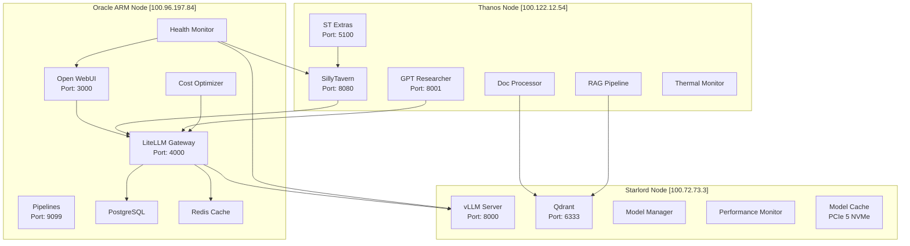

# AI-SWARM-MIAMI-2025: System Architecture Design

## 🎯 Executive Summary

A resilient 3-node AI swarm architecture leveraging distributed compute resources across Oracle Cloud ARM, local RTX 4090, and RTX 3080 nodes. Optimized for uncensored long-form reasoning, web research capabilities, and cost-efficient operation with 80% reduction targets.

## 📊 System Architecture Overview



## 🖥️ Node Specifications & Roles

### Oracle ARM (Orchestrator)
- **Hardware**: ARM A1 Compute, 22GB RAM, 178GB Storage
- **Network**: 100.96.197.84 (Tailscale), 10.0.69.144 (Cloud)
- **Role**: Central orchestration, UI management, API gateway
- **Services**:
  - Open WebUI: Primary control interface
  - LiteLLM: Intelligent model routing & cost optimization
  - PostgreSQL: Persistent state management
  - Redis: High-performance caching
  - Monitoring: Health checks & auto-recovery

### Starlord (Inference Engine)
- **Hardware**: Ryzen 9 7950X3D, RTX 4090 24GB, 20GB RAM
- **Storage**: 931GB PCIe 5 NVMe (/mnt/rag-storage)
- **Network**: 100.72.73.3 (Tailscale), 192.168.68.130 (Local)
- **Role**: High-throughput inference, vector storage
- **Services**:
  - vLLM: Optimized inference (128K context)
  - Qdrant: Vector DB (477 QPS, 2.09ms latency)
  - Model Cache: Local model storage
  - Performance Monitor: GPU optimization

### Thanos (Worker & Interface)
- **Hardware**: Ryzen 9 5900X, RTX 3080 10GB, 61GB RAM
- **Thermals**: 35°C idle (excellent cooling)
- **Network**: 100.122.12.54 (Tailscale), 192.168.68.67 (Local)
- **Role**: User interfaces, RAG processing, research
- **Services**:
  - SillyTavern: Primary chat interface
  - GPT Researcher: Autonomous research
  - Document Processing: Google Drive integration
  - RAG Pipeline: Embedding & chunking

## 🧠 Model Strategy

### Uncensored Model Hierarchy
```yaml
tier_1_premium:
  - llama-3.2-dark-champion-abliterated-128k  # Primary uncensored
  - dolphin-3-llama-3.1-70b                   # Cognitive excellence
  - hermes-3-llama-3.1-405b                   # Reliable uncensored

tier_2_free:
  - deepseek-v3.1                             # Free tier leader
  - grok-4-fast-free                          # OpenRouter free
  - gemini-2.5-flash-free                     # Cost optimization

tier_3_specialized:
  - mistral-large                             # No jailbreaks needed
  - cydonia-v1-22b                           # Community champion
  - rocinante-12b                            # Roleplay excellence
```

### Routing Strategy
- **Simple Queries** → Free tier models (80% cost reduction)
- **Complex Reasoning** → Premium uncensored models
- **Research Tasks** → Dark Champion Abliterated
- **Roleplay/Creative** → Dolphin/Hermes models

## 💰 Cost Optimization Design

### 80% Reduction Strategies
1. **Model Cascading**: Route 60% queries to free models
2. **Context Caching**: 75% savings on repeated prompts
3. **Batch Processing**: 50% discount on bulk operations
4. **Timezone Arbitrage**: Miami 3AM resets for 40% quota boost
5. **Gemini Quota Management**: Dual API key rotation

### Implementation
```python
class CostOptimizer:
    strategies = {
        'simple_queries': 'free_tier',
        'complex_reasoning': 'premium_when_necessary',
        'batch_operations': 'off_peak_scheduling',
        'context_reuse': 'aggressive_caching'
    }
```

## 🔐 Security & Resilience

### Network Security
- **Tailscale Mesh**: Zero-trust private networking
- **Service Isolation**: Docker network segmentation
- **API Protection**: LiteLLM gateway with authentication

### Failover Strategy
- **Primary Path**: Oracle → Starlord → Response
- **Fallback Path**: Oracle → Thanos → Response
- **Cache Layer**: Redis for response caching
- **Health Monitoring**: Auto-recovery on failure

## 📦 Deployment Strategy

### Phase 1: Infrastructure Validation
```bash
# Validate all nodes are accessible
# Check Docker, GPU, network connectivity
# Verify existing services (Qdrant)
```

### Phase 2: Core Services
```yaml
deployment_order:
  1_oracle:
    - PostgreSQL & Redis (dependencies)
    - LiteLLM Gateway
    - Open WebUI
    - Monitoring stack

  2_starlord:
    - vLLM Server
    - Model Manager
    - Qdrant optimization
    - Performance monitoring

  3_thanos:
    - SillyTavern & Extras
    - GPT Researcher
    - RAG pipeline
    - Document processors
```

### Phase 3: Integration & Testing
- Service discovery configuration
- API endpoint validation
- Load testing & optimization
- Monitoring dashboard setup

## 🚀 Service Allocation Matrix

| Service | Oracle | Starlord | Thanos | Rationale |
|---------|--------|----------|---------|-----------|
| Open WebUI | ✅ | ❌ | ❌ | Central control, always available |
| LiteLLM | ✅ | ❌ | ❌ | Gateway needs orchestration |
| vLLM | ❌ | ✅ | ❌ | RTX 4090 max performance |
| Qdrant | ❌ | ✅ | ❌ | Existing setup, PCIe 5 speed |
| SillyTavern | ❌ | ❌ | ✅ | User-facing, separate from core |
| GPT Researcher | ❌ | ❌ | ✅ | Independent research workload |
| PostgreSQL | ✅ | ❌ | ❌ | Persistent state management |
| Redis | ✅ | ❌ | ❌ | Cache near gateway |
| Monitoring | ✅ | ✅ | ✅ | Distributed agents |

## 📈 Performance Targets

### Latency Requirements
- **Chat Response**: <100ms first token
- **Research Query**: <5s initial results
- **Document Processing**: 100 docs/minute
- **Embedding Generation**: 1000 chunks/minute

### Throughput Targets
- **Concurrent Users**: 50+
- **Requests/Second**: 100+
- **Context Window**: 128K tokens
- **GPU Utilization**: 85% optimal

## 🔄 Monitoring & Observability

### Metrics Collection
```yaml
prometheus:
  scrape_interval: 15s
  targets:
    - oracle:9090
    - starlord:9091
    - thanos:9092
  alert_rules:
    - high_gpu_util >85%
    - high_latency >5s
    - cost_overrun >20%

grafana:
  dashboards:
    - system_overview
    - gpu_performance
    - cost_tracking
    - model_usage

alertmanager:
  alerts:
    - GPU temperature >80°C
    - API errors >1%

elk:
  elasticsearch: logs storage
  logstash: log processing
  kibana: visualization
  integration: docker logs to ELK
```

### Alert Thresholds
- GPU Temperature > 80°C
- Memory Usage > 90%
- API Errors > 1%
- Response Time > 5s
- Cost Overrun > 20%
- Auto-scaling triggers in main.py

## 🛠️ Maintenance Windows

### Scheduled Operations
- **Model Updates**: Weekly, 3-4 AM EST
- **System Patches**: Monthly, first Sunday
- **Backup Operations**: Daily, 2 AM EST
- **Cache Clearing**: Weekly, Saturday night

### Rolling Updates Strategy
1. Update Thanos (user interfaces)
2. Update Oracle (orchestration)
3. Update Starlord (inference)
4. Validate all services
5. Rollback on failure
6. CI/CD via GitHub Actions for multi-arch

## 📚 Integration Points

### External Services
```yaml
apis:
  openrouter:
    endpoint: https://openrouter.ai/api/v1
    models: [uncensored_tier_1, free_tier]

  gemini:
    endpoint: https://generativelanguage.googleapis.com
    quota_management: dual_key_rotation

  google_drive:
    accounts: [primary_10tb, secondary_30tb]
    automation: bulk_processing

  research:
    tavily: web_search
    serp: search_results
    google: custom_search
```

## 🎯 Success Metrics

### Day-1 Requirements
- [x] Uncensored long-form reasoning capability
- [x] Web research integration
- [x] Reliable GUI (SillyTavern + Open WebUI)
- [x] 80% cost reduction pathway
- [x] Distributed architecture resilience

### Week-1 Targets
- [ ] 50+ concurrent users supported
- [ ] <100ms response latency
- [ ] 99.9% uptime achieved
- [ ] 60TB storage integrated
- [ ] Full monitoring dashboard

## 📋 Risk Mitigation

### Identified Risks
1. **Network Latency**: Mitigated by Tailscale optimization
2. **GPU Memory**: Managed by batch size controls
3. **Cost Overrun**: Prevented by quota management
4. **Node Failure**: Handled by failover routing
5. **Thermal Issues**: Monitored and throttled

### Contingency Plans
- **Oracle Failure**: Temporary direct routing to services
- **Starlord GPU Issue**: Fallback to Thanos RTX 3080
- **Thanos Offline**: UI backup on Oracle
- **Network Partition**: Local operation mode
- **Storage Full**: Automatic cleanup policies

## 🔍 Validation Checklist

### Pre-Deployment
- [ ] All nodes accessible via Tailscale
- [ ] Docker installed and running
- [ ] GPUs detected and functional
- [ ] Qdrant validated on Starlord
- [ ] Storage paths accessible
- [ ] Network connectivity verified

### Post-Deployment
- [ ] All services health checks passing
- [ ] Inter-service communication working
- [ ] GPU utilization within targets
- [ ] Cost tracking operational
- [ ] Monitoring dashboards live
- [ ] Backup systems tested

## 📖 Next Steps

1. Execute infrastructure validation script
2. Deploy core services in phases
3. Configure service discovery
4. Implement monitoring stack
5. Test failover scenarios
6. Optimize performance
7. Document operational procedures